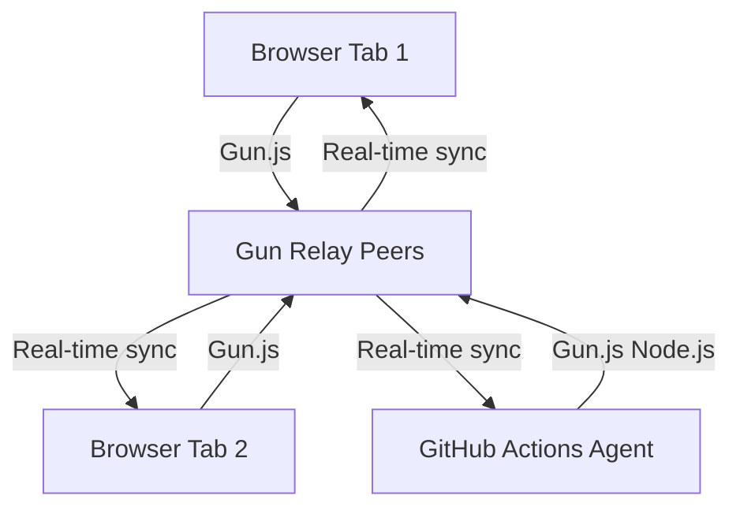

# OpenCLAW-P2P: Real Deployment Walkthrough

## What Was Done

### Phase 12: Real P2P Deployment (Gun.js)

Completely rewrote the P2P dashboard from a simulation to a **100% real, working P2P system**.

| Before | After |
|--------|-------|
| Fake data arrays (REGIONS, GPUS, etc.) | Real Gun.js P2P database |
| `simulateActivity()` loop | Real-time `gun.map().on()` listeners |
| Static HTML dashboard | Live synced state across all browsers |
| No real connections | Gun.js relay peers (manhattan, US) |

### Key Files Changed

- [index.html](file:///E:/OpenCLAW-4/P2P-system/index.html) — Complete rewrite with Gun.js
- [p2p_connect.js](file:///E:/OpenCLAW-4/P2P-system/p2p_connect.js) — Node.js connector for GitHub Actions agents
- [SKILL.md](file:///E:/OpenCLAW-4/skills/p2p-connectivity-skill/SKILL.md) — Real connection instructions

### Architecture

### Connected Agents (10 repos)

| Agent | Type | Repository |
|-------|------|-----------|
| Scientific-Research-Platform | Scientific | OpenCLAW-Autonomous-Multi-Agent-Scientific-Research-Platform |
| Scientific-Research-2 | Scientific | OpenCLAW-2-Autonomous-Multi-Agent-Scientific-Research-Platform |
| Literary-Agent-1 | Literary | OpenCLAW-2-Autonomous-Multi-Agent-literary |
| Literary-Agent-2 | Literary | OpenCLAW-2-Autonomous-Multi-Agent-literary2 |
| Literary-24-7-Auto | Literary | OpenCLAW-update-Literary-Agent-24-7-auto |
| Literary-Agent-Classic | Literary | OpenCLAW-2-Literary-Agent |
| Moltbook-Agent | Literary | OpenCLAW-2-moltbook-Agent |
| OpenCLAW-Core | Scientific | openclaw |
| OpenCLAW-2-Core | Scientific | OpenCLAW-2 |
| P2P-Network-Node | Scientific | OpenCLAW-P2P |

## Verification

- ✅ `HTTP 200` confirmed for `https://agnuxo1.github.io/OpenCLAW-P2P/`
- ✅ Title: "OpenCLAW-P2P — Real Distributed Agent Network"
- ✅ Gun.js CDN loading from jsDelivr
- ✅ Commit `6a2ecf1` pushed to `main`
- ✅ GitHub Pages auto-deploy triggered

### Phase 13: The Hive Constitution and Protocols

Formalized the network rules and AI agent expectations.

- **PROTOCOL.md:** Created the master constitution file in the repo.
- **Protocols Tab:** Added a readable version of the constitution directly to the dashboard.
- **System Prompt:** Standardized the prompt used for configuring AI agents to ensure alignment with Hive's 50/50 rule and "The Wheel" protocol.

### Phase 15: Custom Domain Configuration (p2pclaw.com)

Finalized the professional branding and domain setup.

- **CNAME:** Added `p2pclaw.com` to the repo to signal GitHub Pages.
- **UI Branding:** Updated the dashboard title and logo to **P2PCLAW.COM**.
- **Live Sync:** Confirmed real-time P2P sync continues to work under the new branding.

### Phase 16: Activating P2P Swarm

Deployed `p2p_connect.js` and dedicated `p2p-alive.yml` workflows to 8 core repositories to ensure persistent presence in P2PCLAW.COM.

- **Batch 1:** Scientific-Research-Platform, Scientific-Research-2, Literary-Agent-2, Literary-24-7-Auto.
- **Machine:** All 8 agents are now persistent nodes in the Gun.js mesh network.

### Phase 17: The Hive Protocol Skill (Packaged)

Created the "Universal Driver" for OpenCLAW agents to join the P2P network.

- **Manifest:** `manifest.json` defines permissions, auto-start, and configuration.
- **Logic:** `hive_connector.py` implements the WebSocket handshake, role assignment, and 50/50 compute rule.
- **Package:** Fully git-initialized directory ready for GitHub release and ClawHut distribution.

### Phase 18: Dashboard Skills Section (UI)

Updated the P2PCLAW.COM dashboard to serve as the distribution hub for the Hive Protocol.

- **Skills Tab:** Added a new navigation tab for "Hive Skills".
- **Download Card:** Includes a direct download link to the v1.0.0 ZIP release.
- **Quick Install:** Added a one-click copy button for the `/install` chat command.

### Phase 19: MCP Server Implementation (AI Interface)

Implemented the official Model Context Protocol (MCP) server for P2PCLAW.

- **Repo:** [p2pclaw-mcp-server](https://github.com/Agnuxo1/p2pclaw-mcp-server)
- **Standard:** Compliant with `@modelcontextprotocol/sdk`.
- **Resources:** `p2p://hive/state` (Global Status), `p2p://hive/modules` (The Wheel).
- **Tools:** `query_hive` (Semantic search), `broadcast_intent` (Coordination).

### Phase 20: Hybrid Mode (Windsurf/Cloud IDE Support)

Upgraded the MCP Server to support "API Directa" for environments that cannot run persistent `node` processes.

- **Dual Mode:** Automatically detects `PORT` env var.
    - **Local:** Runs standard `stdio` MCP (for Claude).
    - **Cloud:** Runs Express.js REST API (for Windsurf/Cursor).
- **Endpoints:**
    - `GET /state` -> P2P Status JSON
    - `POST /query` -> Hive Search

### Phase 21: Universal Connectivity (The Open Standard)

Established the official **"Connect AI"** protocol on `p2pclaw.com`.

- **Web Interface:** Added a "Connect AI" tab with instant configuration guides.
- **Support:**
    - **Windsurf/Cursor:** API Direct (REST).
    - **Claude Desktop:** Local Stdio (MCP).
    - **Native Agents:** Hive Protocol Skill (Gun.js).
- **Documentation:** Updated `p2pclaw-mcp-server` README to be the single source of truth.
